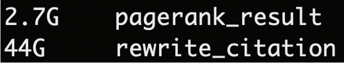

# Proj3-otrap

## 项目要求
1.使用大规模数据处理技术构建引文网络来计算论文重要性分数  
2.搭建Elasticsearch实现从某一个或若干字段检索  
3.结合引文网络重要性分数对检索结果进行调整  
4.当选中一篇论文后，能够以该节点为中心展示引文网络子图  
5.设计并实现一个学术论文搜索引擎网站

## 任务点与分工
1.处理算法(类PageRank)：茅晓璐、李和松  
2.Grape构建引文网络及图计算：茅晓璐  
3.MongoDB：鲍志浩、梁华健  
数据库创建、存储、维护  
4.Elasticsearch：梁华健  
（1）创建索引  
（2）检索逻辑 结合引文网络重要性分数  
5. 后端：梁华健、严畅  
6. 前端：张琦  
7. 可视化模块：张琦

## 开发工具
1.图计算框架：grape  
2.数据库：MongoDB  
3.检索：ElasticSearch   
4.后端：Python、Django  
5.前端：QUASAR、vue2 vuex vue-router、axios、RESTful

## 项目结构


## 图计算部分

### 现有框架
图计算框架 |特点
-------- | -----
Pregel | Google于2010年提出的基于**点中心**计算模型的图计算系统
Giraph | 基于**Hadoop**的图计算系统
Galois | 针对**多线程**进行优化的图计算系统
GraphX | 基于**Spark**的图计算系统
Gemini | 以**计算**为中心的图计算系统
GRAPE | 基于**部分评估理论**的图计算系统

### GRAPE介绍
  [GRAPE](https://github.com/alibaba/libGRAPE-lite)是基于 SIGMOD 2017 best paper——《Parallelizing Sequential Graph Computations》开发的并行图计算框架。

  <center>
  <table><tr>
  	<td><center>
  	<br>
  	<div style="color:orange; border-bottom: 1px solid #d9d9d9;
  	display: inline-block;
  	color: #999;
  	padding: 2px;">GRAPE</div>
  	</center></td>
  	<td><center>
  	<br>
  	<div style="color:orange; border-bottom: 1px solid #d9d9d9;
  	display: inline-block;
  	color: #999;
  	padding: 2px;">GRAPE框架</div>
  	</center></td>
  </tr></table>
</center>
  

  GRAPE的优势 |  原因
  ------ | -----
  易于开发 | 基于部分评估理论，只需少量改动即可将串行计算改成并行，并能将对串行的优化应用到并行中
  易于应用 | 提供了常见的图算法实现，如**SSSP**(单源最短路)、**WCC**(弱连通分量)和**PageRank**等
  易于搭建 | cmake编译，所需依赖少。仅需要cmake/C++11/mpi/glog。
  高效 | 使用C++编写，节约计算资源(所需内存少)，速度快

  GRAPE的效率在实验结果与实际验证中都得到了很好的证明。

  <center>
      
  		<br>
      <div style="color:orange; border-bottom: 1px solid #d9d9d9;
      display: inline-block;
      color: #999;
      padding: 2px;">GRAPE的效率实验</div>
  		<p>
  </center>

  <center>
      
      <br>
      <div style="color:orange; border-bottom: 1px solid #d9d9d9;
      display: inline-block;
      color: #999;
      padding: 2px;">GRAPE与GraphX运行PageRank的效率对比</div>
      <p>
  </center>

### GRAPE实现PageRank
  [PageRank](https://github.com/alibaba/libgrape-lite/blob/master/examples/analytical_apps/pagerank/pagerank.h)

### 实际运行时间
  数据规模：
  点 | 边
  -- | --
  130,906,258 | 2,449,741,490


  使用128G内存服务器，数据存储在机械硬盘中，单进程单线程对全图计算PageRank值，得到如下运算时间。

  <center>
      
      <br>
      <div style="color:orange; border-bottom: 1px solid #d9d9d9;
      display: inline-block;
      color: #999;
      padding: 2px;">GRAPE计算输出</div>
      <p>
  </center>

可以看到，整个过程中IO时间占比极大，可以考虑优化。使用SSD可以使得IO效率进一步提升。

## 数据处理

### 数据分析统计
对原始数据进行分析，得到了原数据的信息。

文件数 | 总行数 | 总大小
-- | -- | --
5999 | 130,906,258 | 124G

通过对原数据中的json文件进行进一步分析，可以得到json文件中包含的关键字段。

字段              | 类型
--               | --
Sid              | String
title            | String
inCitations      | list\<String\>
outCitations     | list\<String\>
year             | number
inCitationsCount | number
outCitationsCount| number

<center>
    
    <br>
    <div style="color:orange; border-bottom: 1px solid #d9d9d9;
    display: inline-block;
    color: #999;
    padding: 2px;">原数据格式</div>
    <p>
</center>

### 数据优化
  通过初步的统计，我们可以发现—— Sid 只有 130,906,258 个，而我们却使用了一个长度为 40 的 String 保存它。如果使用一个长度为 32 位的 int 字段，不仅可以保存下所有的数据，还可以节约存储空间和运算内存，在通信的时候也能有效节约通信成本。

  在处理原数据的时候，使用 Python 的 SimpleJson 库处理 Json 字段，再构建映射、将数据转换成图—— GRAPE 所需的 graph.v 和 graph.e 文件。这样就在一次处理中同时完成了**重映射**和**转图**的过程。

  <center>
      
      <br>
      <div style="color:orange; border-bottom: 1px solid #d9d9d9;
      display: inline-block;
      color: #999;
      padding: 2px;">数据处理流程图</div>
      <p>
  </center>

### 数据输出

中间文件大小及说明
中间文件          | 大小   | 格式| 说明   
--               | --    | -- | --
ciatation.e      | 44G   | u v label| 边文件
ciatation.v      | 1.4G  | v label| 点文件
vertex.map       | 6.2G  | string id| 映射文件
pagerank_result  | 2.7G  | id score| 点的PR值
rewrite_citation | 44G   | json结构 | 最终文件 

<center>
<table><tr>
  <td><center>
  <br>
  <div style="color:orange; border-bottom: 1px solid #d9d9d9;
  display: inline-block;
  color: #999;
  padding: 2px;">中间文件大小</div>
  </center></td>
  <td><center>
  <br>
  <div style="color:orange; border-bottom: 1px solid #d9d9d9;
  display: inline-block;
  color: #999;
  padding: 2px;">数据结果大小</div>
  </center></td>
</tr></table>
</center>

最终得到的数据格式中，将 Sid 改成了它重映射的结果，并将 score 字段加入 json 中。得到的数据规模由原先的 120G 缩减为 44G，减少了 64% 的空间。
<center>
    
    <br>
    <div style="color:orange; border-bottom: 1px solid #d9d9d9;
    display: inline-block;
    color: #999;
    padding: 2px;">最终数据格式</div>
    <p>
</center>

### 数据处理的代码规范

<center>
    
    <br>
    <div style="color:orange; border-bottom: 1px solid #d9d9d9;
    display: inline-block;
    color: #999;
    padding: 2px;">代码规范检查</div>
    <p>
</center>

## 代码风格


## 后端部署、启动运行流程(citation_network)（`篇幅限制的都写了"参考"`）

安装anaconda并创建虚拟环境（Python==3.6），激活虚拟环境
Install the dependencies
```bash
conda install
django==2.2.6
elasticsearch==5.5.3
elasticsearch-dsl==5.3.0
```
配置mongodb和elasticsearch，参考：https://www.yuque.com/huajian-z02yc/ycr4n1/az0epz

打开mongo-connector服务，导入MongoDB数据：
在cmd中输入
```bash
mongorestore -h 127.0.0.1 -d otrap D:\otrap
```
-h后为MongoDB的一个地址，otrap为要导入的数据库名称，D:\otrap为数据存放位置

### Start the app in development mode (hot-code reloading, error reporting, etc.)
```bash
python manage.py runserver
```

# 代码说明（`篇幅限制的都写了"参考"`）
代码目录结构说明，参考：https://blog.csdn.net/Xiayuyuren_Study/article/details/85127905 

代码必要说明：见代码注释


## 前端运行方法(frontend-proj3)
安装 node.js，详见：[安装教程](https://zhuanlan.zhihu.com/p/82347262)

安装 Quasar CLI，详见：http://www.quasarchs.com/quasar-cli/installation#introduction


# 代码说明（`篇幅限制的都写了"详见参考"`）
代码目录结构说明：

详见：http://www.quasarchs.com/quasar-cli/directory-structure#introduction

代码必要说明：

见代码注释

部署过程、启动运行流程：


**Install the dependencies**
```bash
npm install
```

**Start the app in development mode (hot-code reloading, error reporting, etc.)**
```bash
quasar dev
```

依赖的第三方库的目录及版本：
```json
{
  "name": "frontend-proj3",
  "author": "otrap",
  "scripts": {
    "lint": "eslint --ext .js,.vue ./",
    "test": "echo \"No test specified\" && exit 0"
  },
  "dependencies": {
    "@quasar/extras": "^1.0.0",
    "axios": "^0.21.1",
    "core-js": "^3.6.5",
    "echarts": "^5.2.2",
    "quasar": "^1.0.0"
  },
  "devDependencies": {
    "@quasar/app": "^2.0.0",
    "babel-eslint": "^10.0.1",
    "eslint": "^7.21.0",
    "eslint-config-prettier": "^8.1.0",
    "eslint-plugin-vue": "^7.7.0",
    "eslint-webpack-plugin": "^2.4.0"
  },
  "browserslist": [
    "last 10 Chrome versions",
    "last 10 Firefox versions",
    "last 4 Edge versions",
    "last 7 Safari versions",
    "last 8 Android versions",
    "last 8 ChromeAndroid versions",
    "last 8 FirefoxAndroid versions",
    "last 10 iOS versions",
    "last 5 Opera versions"
  ],
  "engines": {
    "node": ">= 10.18.1",
    "npm": ">= 6.13.4",
    "yarn": ">= 1.21.1"
  }
}

```
